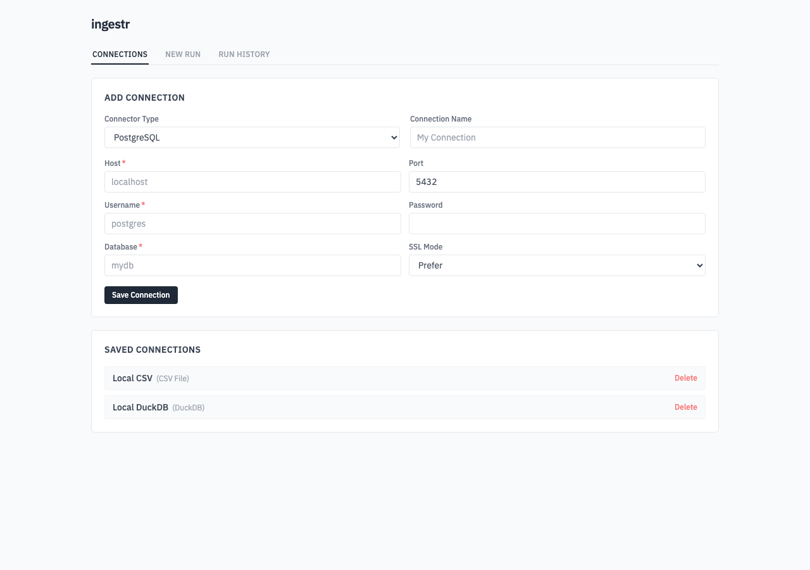
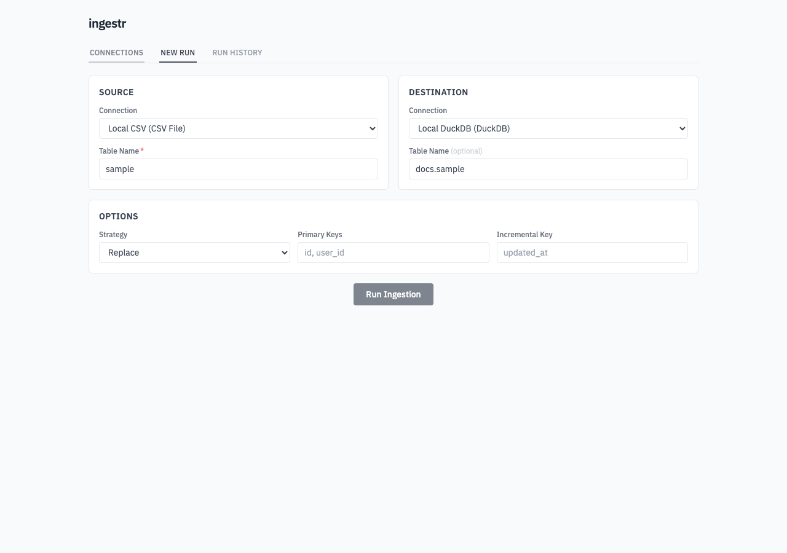
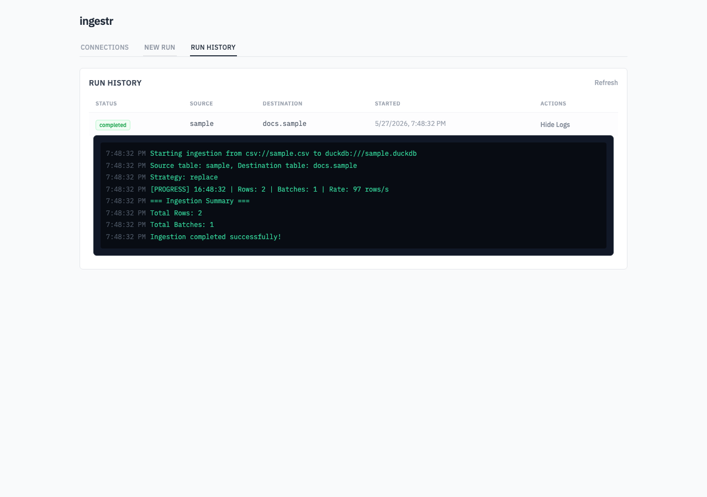

# `ingestr server`

The `server` command starts the ingestr web UI. The UI lets you save reusable
connections, configure an ingestion run, stream logs while the run is active,
and review previous runs.

```bash
ingestr server
```

By default, the server starts on port `8080` and prints the URL:

```text
Starting ingestr web UI on http://localhost:8080
```

Open that URL in your browser to use the UI.

## Options

| Flag | Environment variable | Default | Description |
| --- | --- | --- | --- |
| `--port` | `INGESTR_PORT` | `8080` | Port to listen on. |
| `--creds-file` | `INGESTR_CREDS_FILE` | `creds.json` | Path to the JSON file used to store saved UI connections. |
| `--logs-dir` | `INGESTR_LOGS_DIR` | `logs` | Directory where per-run JSONL log files are written. |
| `--db` | `INGESTR_DB` | `ingestr.db` | Path to the SQLite database used to store run history and logs. |

For example:

```bash
ingestr server \
  --port 3000 \
  --creds-file ~/.ingestr/creds.json \
  --logs-dir ~/.ingestr/logs \
  --db ~/.ingestr/ingestr.db
```

The same configuration can be provided with environment variables:

```bash
export INGESTR_PORT=3000
export INGESTR_CREDS_FILE=~/.ingestr/creds.json
export INGESTR_LOGS_DIR=~/.ingestr/logs
export INGESTR_DB=~/.ingestr/ingestr.db

ingestr server
```

## Connections

The **Connections** tab stores named source and destination connection details.
Choose a connector type, fill in the connector fields, and click **Save
Connection**. Saved connections are written to the configured credentials file.



The credentials file is a local JSON file and is written with owner-only file
permissions. Keep this file private, because it can contain passwords, tokens,
or paths to credentials files.

## New Runs

The **New Run** tab builds an ingestion run from saved source and destination
connections.



The UI supports these run settings:

- Source connection
- Source table
- Destination connection
- Destination table
- Incremental strategy: `replace`, `append`, `merge`, or `delete+insert`
- Primary keys
- Incremental key

If the destination table is empty, the server uses the source table as the
destination table.

For local file connectors such as CSV, SQLite, and DuckDB, absolute paths are
recommended so the generated URI resolves to the intended file.

## Run History

The **Run History** tab shows previous runs from the SQLite database configured
with `--db`. Runs are ordered by start time, newest first. Use **View Logs** to
expand the stored logs for a run.



Logs are stored in two places:

- The SQLite database, so they can be shown in run history.
- The logs directory as one JSONL file per run.

## API

The web UI uses these local API routes:

| Route | Description |
| --- | --- |
| `GET /api/connectors` | Lists connector metadata used by the UI forms. |
| `GET /api/credentials` | Lists saved connections. |
| `POST /api/credentials` | Saves a connection. |
| `DELETE /api/credentials/{id}` | Deletes a saved connection. |
| `POST /api/run` | Starts an ingestion run. |
| `GET /api/jobs/{id}` | Returns the in-memory status for an active or recently completed job. |
| `GET /api/runs` | Lists persisted run history. Supports `limit` and `offset`. |
| `GET /api/runs/{id}` | Returns a persisted run. |
| `GET /api/runs/{id}/logs` | Returns persisted logs for a run. |
| `GET /api/ws/logs/{id}` | Streams live logs for a running job over WebSocket. |

## Security

The server does not require authentication. Run it only on a trusted machine or
trusted network, and do not expose it publicly. Saved connections can contain
sensitive credentials, and anyone who can reach the UI can start ingestion jobs
with those saved connections.

