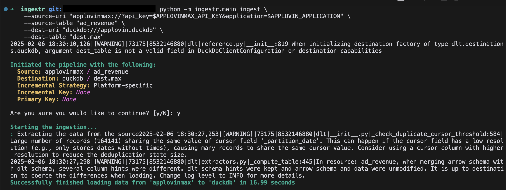

# Applovin Max
[AppLovin Max](https://developers.applovin.com/en/max/getting-started/) is a tool from AppLovin that helps app developers optimize ad revenue by selecting the highest-paying ads from various ad networks.

`ingestr` allows ingesting data from AppLovin Max reporting API.

## URI Format
The URI format for Applovin Max is as follows:
```
applovinmax://?api_key=<your_api_key>&application=<application_name>
```

URI Parameters:
- `api_key`: It is the `report key` which is used for authenticating the request.
- `application`: The application package name (for Android and Fire OS) or bundle ID (for iOS).

## Setting up Applovin Integration

### Generate a Report Key
You can generate a report key from your [AppLovin dashboard](https://developers.applovin.com/en/max/max-dashboard/account/account-info/#keys).

### Example:
To retrieve `ad revenue` data for an application `com.example.app` with api key `key_123`, and to store it in a DuckDB database, use the following command:

```sh
ingestr ingest \
    --source-uri "applovinmax://?api_key=key_123&application=com.example.app" \
    --source-table "ad_revenue" \
    --dest-uri "duckdb:///applovin_max.db"  \
    --dest-table "dest.ad_revenue"
```
By default, `ingestr` retrieves data based on the current UTC time:
- If run after 08:00 UTC, it fetches the previous day's data
- If run before 08:00 UTC, it fetches data from two days ago
For a custom date range, use the `--interval-start` and `--interval-end` parameters.



## Table
[ad_revenue](https://developers.applovin.com/en/max/reporting-apis/user-level-ad-revenue-api/): Provides daily metrics from the user-level ad revenue API. 
