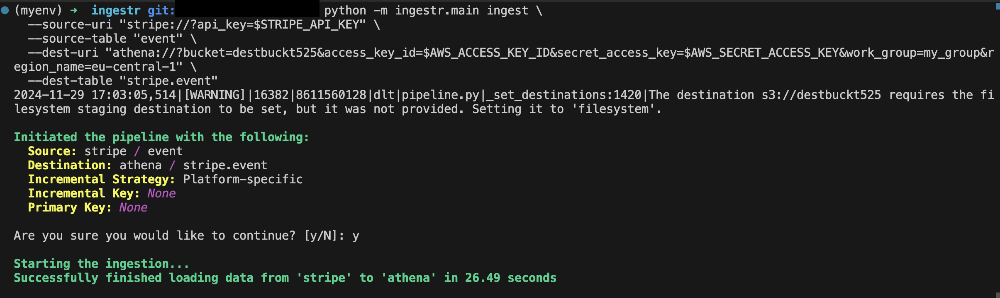

# AWS Athena
[Athena](https://aws.amazon.com/athena/) is an interactive query service that allows users to analyze data directly in Amazon S3 using standard SQL.

The Athena destination stores data as Parquet files in S3 buckets and creates external tables in AWS Glue Catalog.

ingestr supports Athena as a destination.

## URI format
The URI format for Athena is as follows:

```plaintext
athena://?bucket=<your-destination-bucket> \
    access_key_id=<your-aws-access-key-id> \
    secret_access_key=<your-aws-secret-access-key> \
    region_name=<your-aws-region>
```
URI parameters:
- `bucket` (required): The name of the bucket where the data will be stored, containing the Parquet files that Athena will work with, e.g. `your_bucket_name` or `s3://your_bucket_name`.
- `access_key_id` and `secret_access_key` (required): These are AWS credentials that will be used to authenticate with AWS services like S3 and Athena.
- `session_token` (optional): The session token for temporary credentials.
- `region_name` (required if there's no local profile found): The AWS region of the Athena service and S3 buckets, e.g. `eu-central-1`
- `workgroup` (optional): The name of the Athena workgroup, e.g. `my_group`
- `profile` (optional): The name of the AWS profile to use, e.g. `my_profile`

You have two ways of providing credentials:
1. Provide `access_key_id` and `secret_access_key` directly in the URI.
2. Provide the name of the AWS profile to use in the `profile` parameter.

If there's no access key and secret key provided, ingestr will try to find the credentials in the local AWS credentials file.

## Setting up an Athena Integration
Athena requires a `bucket`, `access_key_id`, `secret_access_key` and `region_name` to access the S3 bucket. Please follow the guide on dltHub to obtain [credentials](https://dlthub.com/docs/dlt-ecosystem/destinations/athena#2-setup-bucket-storage-and-athena-credentials). Once you've completed the guide, you should have all the above-mentioned credentials.
```
ingestr ingest \
  --source-uri "stripe://?api_key=key123" \
  --source-table 'event' \
  --dest-uri "athena://?bucket=bucket_123&access_key_id=access_123&secret_access_key=secret_123&region_name=eu-central-1" \
  --dest-table 'stripe.event'
```
This is a sample command that will copy the data from the Stripe source into Athena.


