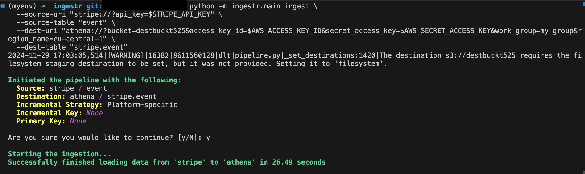

# AWS Athena
[Athena](https://aws.amazon.com/athena/) is an interactive query service that allows users to analyze data directly in Amazon S3 using standard SQL.

The Athena destination stores data as Parquet files in S3 buckets and creates external tables in AWS Glue Catalog.

ingestr supports Athena as a destination.

## URI format
The URI format for Athena is as follows:

```plaintext
athena://?bucket=<your-destination-bucket> \
    access_key_id=<your-aws-access-key-id> \
    secret_access_key=<your-aws-secret-access-key> \
    region_name=<your-aws-region>
```
URI parameters:
- `bucket` (required): The name of the bucket where the data will be stored, containing the Parquet files that Athena will work with, e.g. `your_bucket_name` or `s3://your_bucket_name`.
- `access_key_id` and `secret_access_key` (required): These are AWS credentials that will be used to authenticate with AWS services like S3 and Athena.
- `session_token` (optional): The session token for temporary credentials.
- `region_name` (required if there's no local profile found): The AWS region of the Athena service and S3 buckets, e.g. `eu-central-1`
- `workgroup` (optional): The name of the Athena workgroup, e.g. `my_group`
- `profile` (optional): The name of the AWS profile to use, e.g. `my_profile`

You have two ways of providing credentials:
1. Provide `access_key_id` and `secret_access_key` directly in the URI.
2. Provide the name of the AWS profile to use in the `profile` parameter.

If there's no access key and secret key provided, ingestr will try to find the credentials in the local AWS credentials file.

## Setting up an Athena Integration

Athena requires a `bucket`, `access_key_id`, `secret_access_key` and `region_name` to access the S3 bucket and run queries.

### Step 1: Create an S3 Bucket for Results

1. Go to the [Amazon S3 Console](https://s3.console.aws.amazon.com/)
2. Click **Create bucket**
3. Enter a bucket name (e.g., "my-athena-results")
4. Select the same region where you'll use Athena
5. Click **Create bucket**

### Step 2: Configure an Athena Workgroup

Athena needs a **Query result location** configured on the workgroup it runs through. ingestr uses the account's `primary` workgroup by default.

1. Go to the [Athena Console](https://console.aws.amazon.com/athena/) → **Workgroups**
2. Edit the existing `primary` workgroup (or create a new one)
3. Set **Query result location** to a prefix in the bucket from Step 1 (e.g. `s3://my-athena-results/query-results/`) and save
4. If you created a new workgroup, pass its name via the `workgroup` URI parameter

### Step 3: Create an IAM User with Permissions

1. Go to the [AWS IAM Console](https://console.aws.amazon.com/iam/)
2. Click **Users** → **Add users**
3. Enter a username (e.g., "athena-integration")
4. Select **Access key - Programmatic access**
5. Attach the following managed policies:
   - `AmazonAthenaFullAccess` - For Athena query access
   - `AmazonS3FullAccess` - For S3 bucket access (or create a more restrictive policy)
   - `AWSGlueConsoleFullAccess` - For Glue Catalog access

### Step 4: Get Access Keys

1. After creating the user, copy the **Access key ID** and **Secret access key**
2. Store these credentials securely (the secret key is shown only once)

### Step 5: Note Your Region

Ensure you know the AWS region where your Athena is configured (e.g., `us-east-1`, `eu-central-1`).

Once you have all the credentials:
```
ingestr ingest \
  --source-uri "stripe://?api_key=key123" \
  --source-table 'event' \
  --dest-uri "athena://?bucket=bucket_123&access_key_id=access_123&secret_access_key=secret_123&region_name=eu-central-1" \
  --dest-table 'stripe.event'
```
This is a sample command that will copy the data from the Stripe source into Athena.


