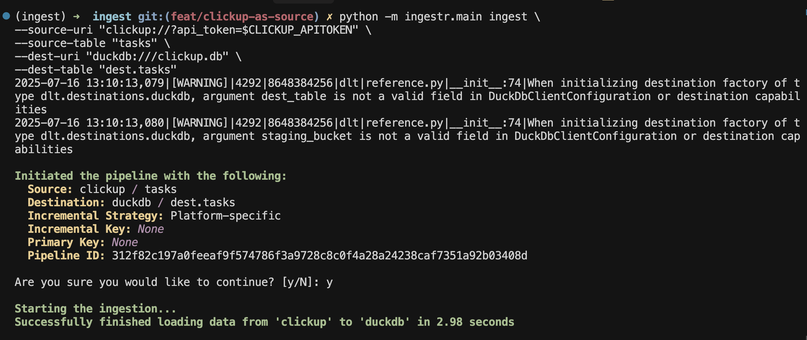

# ClickUp
[ClickUp](https://clickup.com/) is a cloud-based productivity platform designed to help teams and individuals manage tasks, projects, and workflows in one place.

ingestr supports ClickUp as a source.

## URI format

```
clickup://?api_token=<token>
```

URI parameters:
- `api_token` is a personal token used to authenticate with the ClickUp API.

ClickUp requires a `api_token` to connect to the ClickUP API. For more information, read [here](https://developer.clickup.com/docs/authentication#generate-your-personal-api-token) to get credentail. 

Once you've completed the guide, you should have `api_token`. Let's say your API Token  is `token_123`, here's a sample command that will copy the data from Clickup into a DuckDB database:

To ingest tasks from ClickUp into a DuckDB database:

```sh
ingestr ingest \
  --source-uri "clickup://?api_token=token_123" \
  --source-table "tasks" \
  --dest-uri duckdb:///clickup.duckdb \
  --dest-table "public.tasks"
```


## Tables

ClickUp source allows ingesting the following resources into separate tables:

| Table           | PK | Inc Key | Inc Strategy | Details                                                                                                                                        |
| --------------- | ----------- | --------------- | ------------------- | ---------------------------------------------------------------------------------------------------------------------------------------------- |
| [user](https://developer.clickup.com/reference/getauthorizeduser)        | id | -             | merge               | The authorised user profile                       |
| [teams](https://developer.clickup.com/reference/getauthorizedteams) | id | –                | merge               | Workspaces available to the authenticated user. In ClickUp, a "team" in the API is equivalent to a workspace, which is the highest-level container for all spaces, folders, lists, and tasks |
| [spaces](https://developer.clickup.com/reference/getspaces)   | id | -     | merge  | Spaces available within a workspace. Spaces are major sections used to organize work, such as departments, projects, or business units. Each space can contain folders, lists, and tasks |
| [lists](https://developer.clickup.com/reference/getlists)   | id | –  | merge               | Lists contained in each space. Lists are collections of tasks, often representing projects, sprints, or workflow stages |
| [tasks](https://developer.clickup.com/reference/gettasks)    | id | date_updated             | merge            | Tasks belonging to each list |

Use these as `--source-table` parameter in the `ingestr ingest` command.

> [!WARNING]
> ClickUp does not support incremental loading for many endpoints, which means ingestr will load endpoints incrementally if they support it, and do a full-refresh if not.
