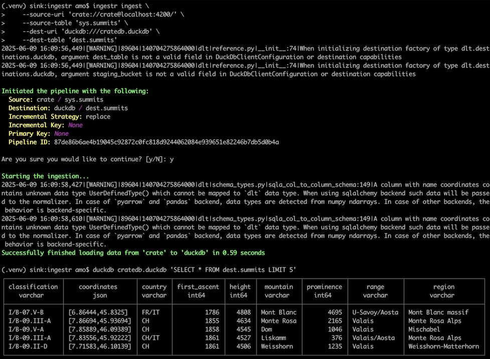
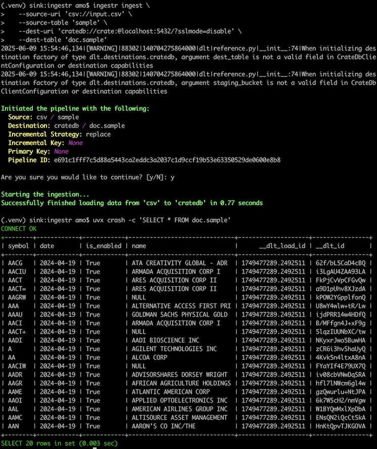

# CrateDB

[CrateDB] is a distributed and scalable SQL database for storing and analyzing
massive amounts of data in near real-time, even with complex queries. It is
PostgreSQL-compatible, and based on Lucene.

ingestr supports CrateDB as a source and destination database.

## Source

For connecting to CrateDB as a database source, ingestr uses its SQLAlchemy
dialect package [sqlalchemy-cratedb].

### URI format

The URI format for CrateDB as a source is as follows:
```plaintext
crate://<username>:<password>@<host>:<port>?ssl=<ssl>
```
> [!INFO]
> The driver does not require any option, and will default to
> `crate://crate@localhost:4200?ssl=false` when just using `crate://`.
>
> When connecting to CrateDB on localhost, use:
> ```plaintext
> crate://crate@localhost:4200?ssl=false
> ```
>
> When connecting to [CrateDB Cloud], the URI looks like this:
> ```plaintext
> crate://admin:<PASSWORD>@<CLUSTERNAME>.eks1.eu-west-1.aws.cratedb.net:4200?ssl=true
> ```

### URI parameters
- `username` (required): The username is required to authenticate with the CrateDB server.
- `password` (required): The password is required to authenticate the provided username.
- `host` (required): The hostname or IP address of the CrateDB server where the database is hosted.
- `port` (required): The TCP port number used by the CrateDB server. Mostly `4200`.
- `ssl` (optional): Set to `true` for a secure HTTPS connection. By default, SSL is disabled (`false`).

### Example

This is an example command that will copy the `sys.summits` table from CrateDB
to DuckDB, then display the content from DuckDB.

```shell
ingestr ingest \
    --source-uri 'crate://crate@localhost:4200/' \
    --source-table 'sys.summits' \
    --dest-uri 'duckdb:///cratedb.duckdb' \
    --dest-table 'dest.summits'
```
```shell
duckdb cratedb.duckdb 'SELECT * FROM dest.summits LIMIT 5'
```



## Destination

For connecting to CrateDB as a database destination, ingestr uses the
[dlt cratedb adapter], which is based on the [dlt postgres adapter],
in turn using the [psycopg2] package.

### URI format

The URI format for CrateDB as a destination is as follows:
```plaintext
cratedb://<username>:<password>@<host>:<port>?sslmode=<sslmode>
```
> [!INFO]
> When connecting to CrateDB on localhost, use:
> ```plaintext
> cratedb://crate:@localhost:5432?sslmode=disable
> ```
>
> When connecting to [CrateDB Cloud], the URI looks like this:
> ```plaintext
> cratedb://admin:<PASSWORD>@<CLUSTERNAME>.eks1.eu-west-1.aws.cratedb.net:5432?sslmode=require
> ```

### URI parameters
- `username` (required): The username is required to authenticate with the CrateDB server.
- `password` (required): The password is required to authenticate the provided username.
- `host` (required): The hostname or IP address of the CrateDB server where the database is hosted.
- `port` (required): The TCP port number used by the CrateDB server. Mostly `5432`.
- `sslmode` (optional): Set to one of `disable`, `allow`, `prefer`, `require`, `verify-ca`,
  or `verify-full`, see [PostgreSQL SSL Mode Descriptions].

### Example

This is an example command that will import a CSV file into CrateDB,
then display the content from CrateDB.

```shell
wget -O input.csv https://github.com/bruin-data/ingestr/raw/refs/heads/main/ingestr/testdata/create_replace.csv
```
```shell
ingestr ingest \
   --source-uri 'csv://input.csv' \
   --source-table 'sample' \
   --dest-uri 'cratedb://crate:@localhost:5432/?sslmode=disable' \
   --dest-table 'doc.sample'
```
```shell
uvx crash -c 'SELECT * FROM doc.sample'
```



> [!WARNING]
> CrateDB supports the `replace` incremental materialization strategy, but
> currently does not support the `delete+insert`, `merge`, or `scd2` strategies.

## Appendix

To start a single-node instance of CrateDB for evaluation purposes,
use Docker or Podman.
```shell
docker run --rm -it --name=cratedb \
  --publish=4200:4200 --publish=5432:5432 \
  --env=CRATE_HEAP_SIZE=2g crate/crate:nightly \
  -Cdiscovery.type=single-node
```

We are tracking development progress and incompatibilities at 
[Support for ingestr/CrateDB] and ["tool: dlt/ingestr"]. Please join the discussion
or share relevant issue reports that help us improve interoperability. Thanks!


[CrateDB]: https://github.com/crate/crate
[CrateDB Cloud]: https://console.cratedb.cloud/
[dlt cratedb adapter]: https://github.com/dlt-hub/dlt/pull/2733
[dlt postgres adapter]: https://github.com/dlt-hub/dlt/tree/devel/dlt/destinations/impl/postgres
[PostgreSQL SSL Mode Descriptions]: https://www.postgresql.org/docs/current/libpq-ssl.html#LIBPQ-SSL-SSLMODE-STATEMENTS
[psycopg2]: https://pypi.org/project/psycopg2-binary/
[sqlalchemy-cratedb]: https://pypi.org/project/sqlalchemy-cratedb/
[Support for ingestr/CrateDB]: https://github.com/crate/crate-clients-tools/issues/86
["tool: dlt/ingestr"]: https://github.com/crate/crate/issues?q=state%3Aopen%20label%3A%22tool%3A%20dlt%2Fingestr%22
