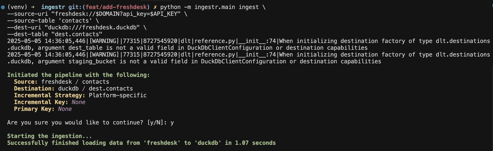

# Freshdesk

[Freshdesk](https://www.freshworks.com/freshdesk/) is a cloud-based customer service platform that helps businesses manages customer support via multiple channels including email,phone,websites, and social media.

ingestr supports Freshdesk as a source.

## URI format

The URI format for Freshdesk is:

```
freshdesk://<domain>?api_key=<api_key>
```

URI parameters:
- `api_key` :  The API token used for authentication with Freshdesk.
- `domain`: The domain of your Freshdesk account, found in your account URL. For example, if your account URL is https://my_company.freshdesk.com/, then `my_company` is your domain.

The URI is used to connect to the Freshdesk API for extracting data.

## Setting up a Freshdesk integration

To connect to Freshdesk, you need to obtain your API key from your account settings.

### Step 1: Get Your API Key

1. Log in to your Freshdesk account
2. Click your profile picture in the top right
3. Select **Profile settings**
4. On the right side, you'll see your **API Key**
5. Copy the API key

### Step 2: Find Your Domain

Your domain is the subdomain in your Freshdesk URL. For example:
- If your URL is `https://mycompany.freshdesk.com/`, your domain is `mycompany`

### API Key Permissions

The API key inherits the permissions of your user account. Make sure your account has access to:
- **Tickets** - For ticket data
- **Contacts** - For contact information
- **Companies** - For company data
- **Agents** - For agent information

> **Tip**: For production use, consider creating a dedicated agent account with appropriate permissions for API access.

Once you have your `api_key` and `domain`, for example, if your api_key is `test_key` and domain `my_company`, you can use the following command to copy data from Freshdesk into a DuckDB database:

```sh
ingestr ingest --source-uri 'freshdesk://$DOMAIN?api_key=$API_KEY' --source-table 'contacts' --dest-uri duckdb:///freshdesk.duckdb --dest-table 'dest.contacts'
```
This command copies data from the Freshdesk source to DuckDB.



## Available Tables

The Freshdesk source allows you to ingest the following tables:

| Table           | PK | Inc Key | Inc Strategy | Details                                                                                                                                        |
| --------------- | ----------- | --------------- | ------------------- | ---------------------------------------------------------------------------------------------------------------------------------------------- |
| [agents](https://developers.freshdesk.com/api/#agents)    | id | updated_at    | merge               | Retrieves users responsible for managing and resolving customer inquiries and support tickets |
| [companies](https://developers.freshdesk.com/api/#companies)     | id | updated_at     | merge               | Retrieves customer organizations or groups that agents support. |
| [contacts](https://developers.freshdesk.com/api/#contacts)     | id | updated_at     | merge               | Retrieves individuals or customers who reach out for support. |
| [groups](https://developers.freshdesk.com/api/#groups)       | id | updated_at     | merge               | Retrieves agents organized based on specific criteria.  |
| [roles](https://developers.freshdesk.com/api/#roles)       | id | updated_at     | merge               | Retrieves predefined sets of permissions that determine what actions an agent can perform.|
| [tickets](https://developers.freshdesk.com/api/#tickets)      | id | updated_at     | merge               | Retrieves customer inquiries or issues submitted via various channels like email, chat, phone, etc.
| [tickets:&lt;query&gt;](https://developers.freshdesk.com/api/#filter_tickets) | id | updated_at | merge | Executes the [Freshdesk ticket filter query](https://developers.freshdesk.com/api/#filter_tickets) while preserving incremental sync. Maximum results: 300 tickets. |

Use these as the `--source-table` parameter in the `ingestr ingest` command.