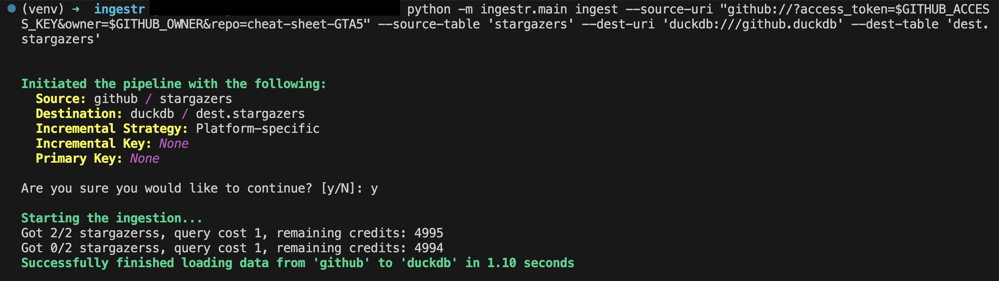

# GitHub

[GitHub](https://github.com/) is a developer platform that allows developers to create, store, manage and share their code.

ingestr supports GitHub as a source.

## URI format

The URI format for GitHub is as follows:

```plaintext
github://?access_token=<access_token>&owner=<owner>&repo=<repo>
```

URI parameters:

- `access_token` (optional): Access Token used for authentication with the GitHub API
- `owner` (required): Refers to the owner of the repository
- `repo` (required): Refers to the name of the repository


## Setting up a GitHub Integration

GitHub requires a few steps to set up an integration, please follow the guide dltHub [has built here](https://dlthub.com/docs/dlt-ecosystem/verified-sources/github#setup-guide).

Once you complete the guide, you should have an access token. Let's say your access token is `ghp_test_1234`, the owner is `max`, and the name of the repository is `test_example`. Here is a sample command that will copy the data from GitHub into a DuckDB database:

```sh
ingestr ingest --source-uri 'github://?access_token=ghp_test_1234&owner=max&repo=test_example' --source-table 'issues' --dest-uri duckdb:///github.duckdb --dest-table 'dest.issues'
```

This is a sample command that will copy the data from the GitHub source to DuckDB.



## Tables

GitHub source allows ingesting the following sources into separate tables:

- `issues`: Retrieves data about issues, their associated comments, and subsequent reactions
- `pull_requests`: Retrieves all pull requests
- `repo_events`: Retrieves all the repo events associated with the repository
- `stargazers`: Retrieves all stargazers

Use these as `--source-table` parameter in the `ingestr ingest` command.

> [!WARNING]
> GitHub does not support incremental loading for many endpoints in its APIs, which means ingestr will load endpoints incrementally if they support it, and do a full-refresh if not.
 