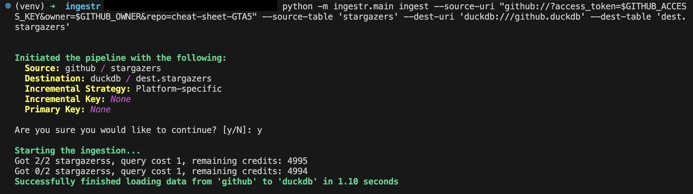

# GitHub

[GitHub](https://github.com/) is a developer platform that allows developers to create, store, manage and share their code.

ingestr supports GitHub as a source.

## URI format

The URI format for GitHub is as follows:

```plaintext
github://?access_token=<access_token>&owner=<owner>&repo=<repo>
```

URI parameters:

- `access_token` (optional): Access Token used for authentication with the GitHub API
- `owner` (required): Refers to the owner of the repository
- `repo` (required): Refers to the name of the repository


## Setting up a GitHub Integration

To connect to GitHub, you need to create a Personal Access Token (PAT).

### Step 1: Create a Personal Access Token

1. Log in to [GitHub](https://github.com/)
2. Click your profile picture → **Settings**
3. Scroll down and click **Developer settings** in the left sidebar
4. Click **Personal access tokens** → **Tokens (classic)** or **Fine-grained tokens**

### Option A: Classic Token

1. Click **Generate new token** → **Generate new token (classic)**
2. Enter a note (e.g., "Data Integration")
3. Select an expiration period
4. Select scopes:
   - `repo` - Full access to repositories (for private repos)
   - `public_repo` - Access to public repositories only
5. Click **Generate token**
6. Copy the token immediately (starts with `ghp_`)

### Option B: Fine-grained Token (Recommended)

1. Click **Generate new token** → **Generate new token (fine-grained)**
2. Enter a token name and expiration
3. Under **Repository access**, select the repositories you need
4. Under **Permissions**, set:
   - **Issues**: Read-only (for issues table)
   - **Pull requests**: Read-only (for pull_requests table)
   - **Contents**: Read-only (for repo_events)
   - **Metadata**: Read-only (required)
5. Click **Generate token**
6. Copy the token (starts with `github_pat_`)

> **Note**: The access token is optional for public repositories, but recommended to avoid rate limits.

Once you have your access token, let's say your access token is `ghp_test_1234`, the owner is `max`, and the name of the repository is `test_example`. Here is a sample command that will copy the data from GitHub into a DuckDB database:

```sh
ingestr ingest --source-uri 'github://?access_token=ghp_test_1234&owner=max&repo=test_example' --source-table 'issues' --dest-uri duckdb:///github.duckdb --dest-table 'dest.issues'
```

This is a sample command that will copy the data from the GitHub source to DuckDB.



## Tables

GitHub source allows ingesting the following sources into separate tables:
| Table           | PK | Inc Key | Inc Strategy | Details                                                                                                                                        |
| --------------- | ----------- | --------------- | ------------------- | ---------------------------------------------------------------------------------------------------------------------------------------------- |
| `issues`        | - | –                | replace               | Retrieves GitHub issues along with their comments and reactions. Full reload on each run.                                        |
| `pull_requests` | - | –                | replace               | Retrieves pull requests with comments and reactions. Full reload on each run.                                                    |
| `repo_events`   | `id` | `created_at`     | merge  | Retrieves recent repository events. Appends only new events using `created_at` filter. Only events from the past 30 days allowed. |
| `stargazers`    | - | –                | replace               | Retrieves stargazers. Full reload on each run.                                  |


Use these as `--source-table` parameter in the `ingestr ingest` command.
 