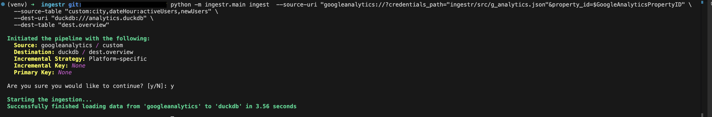
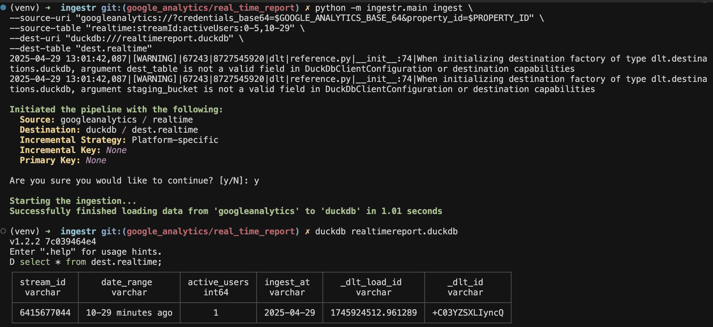

# Google Analytics
[Google Analytics](https://marketingplatform.google.com/about/analytics/) is a service for web analytics that tracks and provides data regarding user engagement with your website or application.

ingestr supports Google Analytics as a source.

## URI format
The URI format for Google Analytics is as follows:

```plaintext
googleanalytics://?credentials_path=/path/to/service/account.json&property_id=<property_id>
```
Alternatively, you can use base64 encoded credentials:

```
googleanalytics://?credentials_base64=<base64_encoded_credentials>&property_id=<property_id>
```

URI parameters:
- `credentials_path`: The path to the service account JSON file.
- `property_id`: It is a unique number that identifies a particular property on Google Analytics. [Follow this guide](https://developers.google.com/analytics/devguides/reporting/data/v1/property-id#what_is_my_property_id) to know more about property ID.

## Setting up a Google Analytics Integration

To connect to Google Analytics, you need to create a Google Cloud service account and grant it access to your GA4 property.

### Step 1: Create a Google Cloud Project

1. Go to [Google Cloud Console](https://console.cloud.google.com/)
2. Create a new project or select an existing one
3. Note your project ID

### Step 2: Enable the Google Analytics Data API

1. In the Cloud Console, go to **APIs & Services** → **Library**
2. Search for "Google Analytics Data API"
3. Click on it and then click **Enable**

### Step 3: Create a Service Account

1. Go to **APIs & Services** → **Credentials**
2. Click **Create Credentials** → **Service Account**
3. Enter a name (e.g., "ga-integration") and click **Create**
4. Skip the optional steps and click **Done**

### Step 4: Generate a JSON Key

1. Click on the service account you just created
2. Go to the **Keys** tab
3. Click **Add Key** → **Create new key**
4. Select **JSON** and click **Create**
5. The JSON key file will be downloaded automatically - save it securely

### Step 5: Grant Access in Google Analytics

1. Open [Google Analytics](https://analytics.google.com/)
2. Go to **Admin** (gear icon)
3. In the **Property** column, click **Property Access Management**
4. Click the **+** button and select **Add users**
5. Enter the service account email (found in your JSON file as `client_email`)
6. Select **Viewer** role (minimum required)
7. Click **Add**

The JSON file path is your `credentials_path`, and your GA4 Property ID is the `property_id` for the ingestr URI. 

## Available Tables:


| Table           | PK | Inc Key | Inc Strategy | Details                                                                                                                                        |
| --------------- | ----------- | --------------- | ------------------- | ---------------------------------------------------------------------------------------------------------------------------------------------- |
| [realtime](https://developers.google.com/analytics/devguides/reporting/data/v1/realtime-basics)     | ingested_at |  -    | merge               | Retrieves real-time analytics data based on specified dimensions and metrics. Format: `realtime:<dimensions>:<metrics>:<minutes_ranges>`. Supports incremental loading by ingestion timestamp. |
| `custom` | datetime_dimension | datetime_dimension    |     merge           | Retrieves custom reports based on specified dimensions and metrics. Format: `custom:<dimensions>:<metrics>` |

### Custom reports 
- `Custom reports`: allow you to retrieve data based on specific `dimensions` and  `metrics`.

 #### Custom Table Format:
```
custom:<dimensions>:<metrics>
```

 #### Parameters:
- `dimensions`(required): A comma-separated list of [dimensions](https://developers.google.com/analytics/devguides/reporting/data/v1/api-schema#dimensions) to retrieve.
- `metrics`(required): A comma-separated list of [metrics](https://developers.google.com/analytics/devguides/reporting/data/v1/api-schema#metrics) to retrieve.

 #### Example

```sh
ingestr ingest \
    --source-uri "googleanalytics://?credentials_path="ingestr/src/g_analytics.json&property_id=id123" \
    --source-table "custom:date:activeUsers" \
    --dest-uri "duckdb:///analytics.duckdb" \
    --dest-table "dest.custom"
```

This command will retrieve report and save it to the `dest.custom` table in the DuckDB database.




### Realtime reports
`Realtime reports`: allows you to retrieve data based on specific `dimensions`, `metrics`, with optional `minutes_ranges`.

 #### Realtime Report Table Format:
```
realtime:<dimensions>:<metrics>

```
```
realtime:<dimensions>:<metrics>:<minutes_ranges>
```

 #### Parameters:
- `dimensions`(required): A comma-separated list of [dimensions](https://developers.google.com/analytics/devguides/reporting/data/v1/exploration-api-schema#dimensions) to retrieve.
- `metrics`(required): A comma-separated list of [metrics](https://developers.google.com/analytics/devguides/reporting/data/v1/exploration-api-schema#metrics) to retrieve.
- `minutes_ranges`(optional): Allows you to specify time windows for retrieving data. You can define up to two time ranges in your query, formatted as comma-separated values (e.g., "0-5,25-29"). Each range represents minutes in the past from the current time.
If no minute_ranges are specified, the system defaults to retrieving data from the last 30 minutes. For more information read [here](https://developers.google.com/analytics/devguides/reporting/data/v1/realtime-basics#minute_ranges)

#### Example

```sh
ingestr ingest \
    --source-uri "googleanalytics://?credentials_path="ingestr/src/g_analytics.json&property_id=id123" \
    --source-table "realtime:streamId:activeUsers:0-4,10-29" \
    --dest-uri "duckdb:///analytics.duckdb" \
    --dest-table "dest.realtime"
```
This command will retrieve report and save it to the `dest.realtime` table in the DuckDB database.


