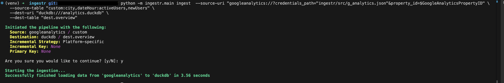

# Google Analytics
[Google Analytics](https://marketingplatform.google.com/about/analytics/) is a service for web analytics that tracks and provides data regarding user engagement with your website or application.

ingestr supports Google Analytics as a source.

## URI format
The URI format for Google Analytics is as follows:

```plaintext
googleanalytics://?credentials_path=/path/to/service/account.json&property_id=<property_id>
```
Alternatively, you can use base64 encoded credentials:

```
googleanalytics://?credentials_base64=<base64_encoded_credentials>&property_id=<property_id>
```

URI parameters:
- `credentials_path`: The path to the service account JSON file.
- `property_id`: It is a unique number that identifies a particular property on Google Analytics. [Follow this guide](https://developers.google.com/analytics/devguides/reporting/data/v1/property-id#what_is_my_property_id) to know more about property ID.

## Setting up a Google Analytics Integration
Google Analytics requires a few steps to set up an integration, please follow the guide dltHub [has built here](https://dlthub.com/docs/dlt-ecosystem/verified-sources/google_analytics#grab-google-service-account-credentials). Once you complete the guide, you should have an `.json` file  and `project_id`. 

## Available Tables:
### Custom reports 
- `Custom reports`: allow you to retrieve data based on specific `dimensions` and  `metrics`.

 #### Custom Table Format:
```
custom:<dimensions>:<metrics>
```

 #### Parameters:
- `dimensions`(required): A comma-separated list of [dimensions](https://developers.google.com/analytics/devguides/reporting/data/v1/api-schema#dimensions) to retrieve.
- `metrics`(required): A comma-separated list of [metrics](https://developers.google.com/analytics/devguides/reporting/data/v1/api-schema#metrics) to retrieve.

 #### Example

```sh
ingestr ingest \
    --source-uri "googleanalytics://?credentials_path="ingestr/src/g_analytics.json&property_id=id123" \
    --source-table "custom:date:activeUsers" \
    --dest-uri "duckdb:///analytics.duckdb" \
    --dest-table "dest.custom"
```

This command will retrieve report and save it to the `dest.custom` table in the DuckDB database.




### Realtime reports
`Realtime reports`: allows you to retrieve data based on specific `dimensions`, `metrics`, with optional `minutes_ranges`.

 #### Realtime Report Table Format:
```
realtime:<dimensions>:<metrics>

```
```
realtime:<dimensions>:<metrics>:<minutes_ranges>
```

 #### Parameters:
- `dimensions`(required): A comma-separated list of [dimensions](https://developers.google.com/analytics/devguides/reporting/data/v1/exploration-api-schema#dimensions) to retrieve.
- `metrics`(required): A comma-separated list of [metrics](https://developers.google.com/analytics/devguides/reporting/data/v1/exploration-api-schema#metrics) to retrieve.
- `minutes_ranges`(optional): Allows you to specify time windows for retrieving data. You can define up to two time ranges in your query, formatted as comma-separated values (e.g., "0-5,25-29"). Each range represents minutes in the past from the current time.
If no minute_ranges are specified, the system defaults to retrieving data from the last 30 minutes. For more information read [here](https://developers.google.com/analytics/devguides/reporting/data/v1/realtime-basics#minute_ranges)

#### Example

```sh
ingestr ingest \
    --source-uri "googleanalytics://?credentials_path="ingestr/src/g_analytics.json&property_id=id123" \
    --source-table "realtime:streamId:activeUsers:0-4,10-29" \
    --dest-uri "duckdb:///analytics.duckdb" \
    --dest-table "dest.realtime"
```
This command will retrieve report and save it to the `dest.realtime` table in the DuckDB database.

