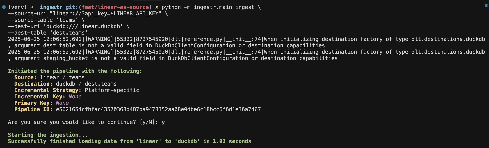

# Linear

[Linear](https://linear.app/) is a purpose-built tool for planning and building products that provides issue tracking and project management for teams.

ingestr supports Linear as a source through [Linear's public API](https://linear.app/developers/graphql).

## URI format

The URI format for Linear is:

```plaintext
linear://?api_key=<api_key>
```

URI parameters:

- `api_key`: The API key used for authentication with the Linear API.

## Example usage

Assuming your API key is `lin_api_123`, you can ingest teams into DuckDB using:

```bash
ingestr ingest
--source-uri 'linear://?api_key=lin_api_123' \
--source-table 'teams' \
--dest-uri duckdb:///linear.duckdb \
--dest-table 'dest.teams'
```


## Tables
Linear source allows ingesting the following tables:
| Table           | PK | Inc Key | Inc Strategy | Details                                                                                                                                        |
| --------------- | ----------- | --------------- | ------------------- | ---------------------------------------------------------------------------------------------------------------------------------------------- |
| `issues`        | id | updatedAt    | merge               | Fetches all issues from your Linear workspace. |
| `users`         | id | updatedAt     | merge               | Fetches users from your workspace. |
| `workflow_states` | id | updatedAt    | merge               | Fetches workflow states used in your Linear workspace. |
| `cycles`        | id | updatedAt     | merge               |  Fetches cycle information and planning data. |
| `attachments`   | id | updatedAt    | merge               | Fetches file attachments associated with issues. |
| `comments`      | id | updatedAt    | merge               | Fetches comments on issues and other entities. |
| `documents`     | id | updatedAt    | merge               | Fetches documents created in Linear. |
| `external_users` | id | updatedAt     | merge               | Fetches information about external users. |
| `initiative`    | id | updatedAt   | merge               | Fetches initiative data for high-level planning. |
| `integrations`  | id | updatedAt    | merge               | Fetches integration configurations. |
| `labels`        | id | updatedAt     | merge               | Fetches labels used for categorizing issues. |
| `project_updates` | id | updatedAt     | merge               | Fetches updates posted to projects |
| `team_memberships` | id | updatedAt    | merge               | Fetches team membership information. |
| `initiative_to_project` | id | updatedAt     | merge               | Fetches relationships between initiatives and projects.  |
| `project_milestone` | id | updatedAt     | merge               | Retrieves Linear project milestones and checkpoints. |
| `project_status` | id | updatedAt     | merge               | Fetches project status information. |
| `projects`      | id | updatedAt    | merge               | Fetches project-level data. |
| `teams`         | id | updatedAt     | merge               | Fetches information about the teams configured in Linear. |
| `organization`  | id | updatedAt     | merge               | Fetches organization-level information.|


Use these as the `--source-table` parameter in the `ingestr ingest` command.
