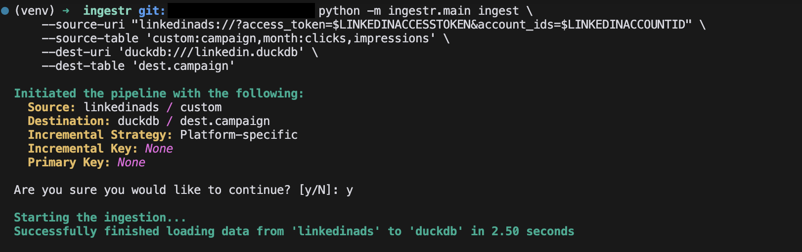

# LinkedIn Ads
LinkedIn Ads is a platform that allows businesses and marketers to create, manage, and analyze advertising campaigns.

Ingestr supports LinkedIn Ads as a source.

## URI format
The URI format for LinkedIn Ads as a source is as follows:

```plaintext
linkedinads://?access_token=<access_token>&account_ids=<account_ids>
```
## URI parameters:
- `access_token`(required): It is used for authentication and is necessary to access data and reports through the LinkedIn Ads API. The access token lets your app access data using the permissions you set in the Developer App for your LinkedIn account.
- `account_ids`(required): The comma-separated list of Ad Account IDs specifies the LinkedIn Ad Accounts for which you want to retrieve data. These IDs uniquely identify the LinkedIn Ad Accounts associated with a company, business, or individual, depending on the ownership of the Ad Accounts. They are required to fetch data for campaigns, creatives, and other related resources.

LinkedIn Ads requires an `access_token` and `account_ids` to retrieve reports from the [LinkedIn Ads API](https://learn.microsoft.com/en-us/linkedin/marketing/integrations/ads-reporting/ads-reporting?view=li-lms-2024-11&tabs=http#analytics-finder). Please follow these steps to obtain the `access_token` and `account_ids`

### Create a LinkedIn developer application to obtain an access token
1. Log in to LinkedIn with a [developer account](https://www.linkedin.com/developers)
2. Click Create App. Please fill out:
    - App Name
    - Your company's LinkedIn page
    - Your company's privacy policy URL
    - Your company logo
- Accept the terms and click "Create App"
3. To verify your app:
   - Go to "Settings" tab
   - Find "App Settings"
   - Click "Verify" under Company
   - Click "Generate URL"
   - Send this URL to your Page Admin 
   - Click "I'm done" and open the URL in a new tab to verify, if you are the admin of your page.
   -  Go to the "Products" tab, and click "Request access" for the Advertising API. It will take about a few minutes to get approved and then you need to fill out the form where you have to provide your company name, website, and other details.

#### Authorize your app and obtain access token
1. Go to the "Auth" tab
4. Click "OAuth 2.0 tools" which is on top right corner of the page [link](https://www.linkedin.com/developers/tools/oauth)
5. Click "Create token"
6. Choose these permissions:
   - `r_ads`
   - `r_ads_reporting`
7. Click "Request access token"
8. You will be redirected to an authorization page. Use your LinkedIn credentials to log in and authorize your app and obtain your Access Token and Refresh Token. Copy the Access Token.

> [!NOTE]
> Access tokens last for 2 months. After they expire, you'll need to make new ones using 
> [LinkedIn's Token Generator](https://www.linkedin.com/developers/tools/oauth/token-generator).

To find the Ad Account IDs, the ad account owner can refer to the detailed instructions provided in this [guide](https://www.linkedin.com/help/linkedin/answer/a424270/find-linkedin-ads-account-details?lang=en).

## Table: Custom Reports    
Custom reports allow you to retrieve data based on specific dimensions and metrics.

Custom Table Format:
```
custom:<dimensions>:<metrics>
```
### Parameters:
- `dimensions`(required): A comma-separated list of dimensions is required. It must include at least one of the following: `campaign`, `account`, or `creative`, along with one time-based dimension, either `date` or `month`.
  - `date`: group the data in your report by day
  - `month`: group the data in your report by month
- `metrics`(required): A comma-separated list of [metrics](https://learn.microsoft.com/en-us/linkedin/marketing/integrations/ads-reporting/ads-reporting?view=li-lms-2024-11&tabs=http#metrics-available) to retrieve.

> [!NOTE]
> By default, ingestr fetches data from January 1, 2018 to today's date. You can specify a custom date range using the `--interval-start` and `--interval-end` parameters.

### Example

Retrieve data for campaign with `account_ids` id_123 and id_456:
```sh
ingestr ingest \                         
    --source-uri "linkedinads://?access_token=token_123&account_ids=id_123,id_456" \
    --source-table 'custom:campaign,date:impressions,clicks' \
    --dest-uri 'duckdb:///linkedin.duckdb' \
    --dest-table 'dest.campaign'
```

The applied parameters for the report are:
- dimensions: `campaign`, `date`
- metrics: `impressions`, `clicks`

Retrieve data for creative with `account_ids` id_123 and id_456 for the date range from 2024-10-15 to 2024-12-31:
```sh
ingestr ingest \                         
    --source-uri "linkedinads://?access_token=token_123&account_ids=id_123,id_456" \
    --source-table 'custom:creative,month:impressions,shares,videoCompletions' \
    --dest-uri 'duckdb:///linkedin.duckdb' \
    --dest-table 'dest.creative'
    --interval-start '2024-10-15'
    --interval-end '2024-12-31'
```
The applied parameters for the report are:
- dimensions: `creative`, `month`
- metrics: `shares`, `impressions`, `videoCompletions`

```sh
ingestr ingest \                         
    --source-uri "linkedinads://?access_token=token_123&account_ids=id_123,id_456" \
    --source-table 'custom:account,month:totalEngagements,impressions,' \
    --dest-uri 'duckdb:///linkedin.duckdb' \
    --dest-table 'dest.account'
```
The applied parameters for the report are:
- dimensions: `account`, `month`
- metrics: `totalEngagements`, `impressions`

This command will retrieve data and save it to the destination table in the DuckDB database.

