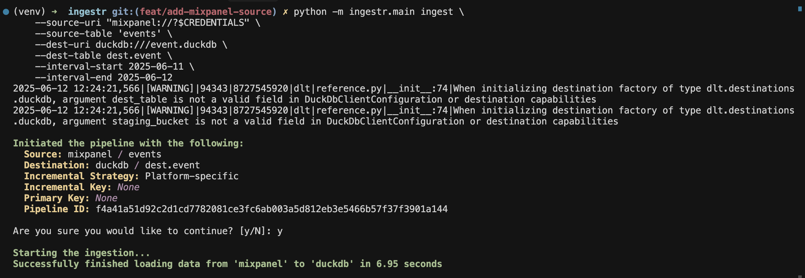

# Mixpanel

[Mixpanel](https://mixpanel.com/) is an analytics service for tracking user interactions in web and mobile applications.

ingestr supports Mixpanel as a source.

## URI format

```plaintext
mixpanel://?username=<service_account_username>&password=<service_account_secret>&project_id=<project_id>&server=<server>
```

URI parameters:

- `username`: Mixpanel service account username.
- `password`: Mixpanel service account secret. This is the secret associated with the service account.
- `project_id`: The numeric project ID.
- `server`: (Optional) The server region to use. Can be "us", "eu", or "in". Defaults to "eu".


To grab mixpanel credentials, please follow the guide [here](https://developer.mixpanel.com/reference/service-accounts).

## Example

Copy events from Mixpanel into a DuckDB database:

```sh
ingestr ingest \
    --source-uri 'mixpanel://?username=my-service-account&password=my-secret&project_id=12345' \
    --source-table 'events' \
    --dest-uri duckdb:///mixpanel.duckdb \
    --dest-table 'mixpanel.events'
```





## Tables

Mixpanel source allows ingesting the following tables:

| Table           | PK | Inc Key | Inc Strategy | Details                                                                                                                                        |
| --------------- | ----------- | --------------- | ------------------- | ---------------------------------------------------------------------------------------------------------------------------------------------- |
| [events](https://developer.mixpanel.com/reference/raw-event-export)        | distinct_id | time     | merge               | Retrieves events data|
| [profiles](https://developer.mixpanel.com/reference/engage-query)     | distinct_id | last_seen     | merge               | Retrieves Mixpanel user profiles and attributes. |

Use these as `--source-table` values in the `ingestr ingest` command.
