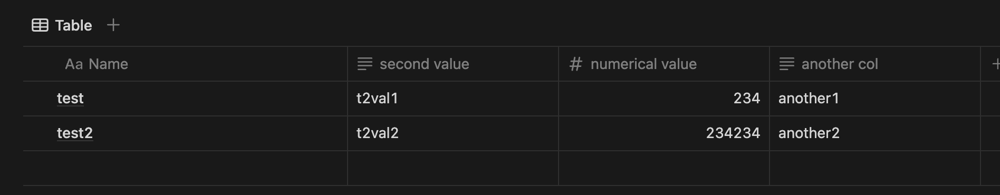

# Notion
[Notion](https://www.notion.so/) is an all-in-one workspace for note-taking, project management, and database management.

ingestr supports Notion as a source.

## URI Format
The URI format for Notion is as follows:

```plaintext
notion://?api_key=token
```

URI parameters:
- `api_key`: the integration token used for authentication with the Notion API

The URI is used to connect to the Notion API for extracting data. More details on setting up Notion integrations can be found [here](https://developers.notion.com/docs/getting-started).

## Setting up a Notion Integration

Notion requires a few steps to set up an integration, please follow the guide dltHub [has built here](https://dlthub.com/docs/dlt-ecosystem/verified-sources/notion#setup-guide).

Once you complete the guide, you should have an API key, and the table ID to connect to. Let's say your API token is `secret_12345` and the database you'd like to connect to is `bfeaafc0c25f40a9asdasd672a9456f3`, here's a sample command that will copy the data from the Notion table into a duckdb database:

```sh
ingestr ingest --source-uri 'notion://?api_key=secret_12345' --source-table 'bfeaafc0c25f40a9asdasd672a9456f3' --dest-uri duckdb:///notion.duckdb --dest-table 'notion.output'
```

The result of this command will be a bunch of tables in the `notion.duckdb` database. The Notion integration creates a bunch of extra tables in the schema to keep track of additional information about every field in a database. You should take some time to play around with the data and understand how it's structured, and take a good look at `_dlt_parent_id` column in the tables to understand the relationships between tables.

Take a look at the following Notion table:


Ingesting this table using ingestr will create a bunch of new tables with quite a lot of details in them. The following query is a reconstruction of the table as it looks on Notion:

```sql
select n.text__content, s.text__content, o.properties__numerical_value__number, r.text__content
from notion.output o
         join notion.output__properties__name__title n on n._dlt_parent_id = o._dlt_id
         join notion.output__properties__another_col__rich_text r on r._dlt_parent_id = o._dlt_id
         join notion.output__properties__second_value__rich_text s on s._dlt_parent_id = o._dlt_id
order by 1;
```

Take this as a starting point and play around with the data.


> [!CAUTION]
> Notion does not support incremental loading, which means every time you run the command, it will copy the entire table from Notion to the destination. This can be slow for large tables.

