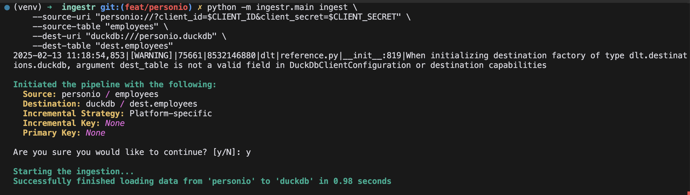

# Personio
[Personio](https://personio.de/) is a human resources management software that helps businesses
streamline HR processes, including recruitment, employee data management, and payroll, in one
platform.

ingestr supports Personio as a source.

## URI format

The URI format for Personio is as follows:

```plaintext
personio://?client_id=<client-id>&client_secret=<client-secret>
```

URI parameters:

- `client_id`: the client ID used for authentication with the Personio API
- `client_secret`: the client secret used for authentication with the Personio API

## Setting up a Personio Integration

To grab personio credentials, please follow the guide [here](https://dlthub.com/docs/dlt-ecosystem/verified-sources/personio#grab-credentials).

Once you complete the guide, you should have a client ID and client secret. Let's say your `client_id` is id_123 and your `client_secret` is secret_123, here's a sample command that will copy the data from Personio into a DuckDB database:

```bash
ingestr ingest --source-uri 'personio://?client_id=id_123&client_secret=secret_123' \
 --source-table 'employees' \
 --dest-uri duckdb:///personio.duckdb \
 --dest-table 'dest.employees'
```




Personio source allows ingesting the following resources into separate tables:

## Tables

Personio source allows ingesting the following sources into separate tables:

| Table           | PK | Inc Key | Inc Strategy | Details                                                                                                                                        |
| --------------- | ---| ----| - | ---------------------------------------------------------------------------------------------------------------------------------------------- |
| [employees](https://developer.personio.de/v1.0/reference/get_company-employees) | id | last_modified_at | merge | Retrieves company employees details.   |
| [absence_types](https://developer.personio.de/v1.0/reference/get_company-time-off-types) | id | – | replace | Retrieves list of various types of employee absences Retrieves absence periods for absences tracked in days.         |
| [absences](https://developer.personio.de/v1.0/reference/get_company-time-offs) | id | updated_at | merge |  Fetches absence periods for absences with time unit set to days. |
| [attendances](https://developer.personio.de/v1.0/reference/get_company-attendances) | id | updated_at | merge              | Retrieves attendance records for each employee|
| [projects](https://developer.personio.de/v1.0/reference/get_company-attendances-projects) | id | – | replace               | Retrieves a list of all company projects|
| [document_categories](https://developer.personio.de/v1.0/reference/get_company-document-categories) | id | –  | replace | Retrieves all document categories of the company      |
| [custom_reports_list](https://developer.personio.de/v1.0/reference/listreports) | id | – | replace | Retrieves metadata about existing custom reports in your Personio account, such as report name, report type, report date / timeframe.      |
| [employees_absences_balance](https://developer.personio.de/v1.0/reference/get_company-employees-employee-id-absences-balance) | [employee_id,id] | –  | merge | Retrieves the absence balance for a specific employee    |

Use these as `--source-table` parameter in the `ingestr ingest` command.\


> [!WARNING]
> Personio does not support incremental loading for many endpoints, which means ingestr will load endpoints incrementally if they support it, and do a full-refresh if not.