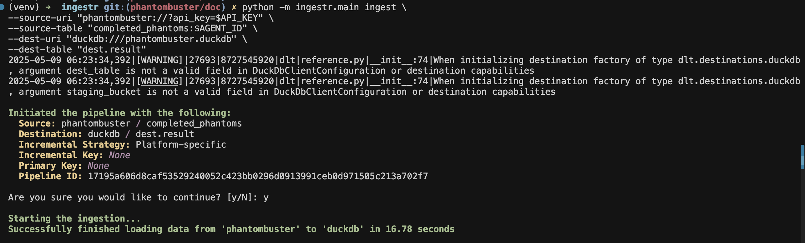

# PhantomBuster
[PhantomBuster](https://phantombuster.com/) is a cloud-based data automation and web scraping platform that allows users to extract data from websites, automate actions.

ingestr supports PhantomBuster as a source.

## URI format

The URI format for PhantomBuster is as follows:

```plaintext
PhantomBuster://?api_key=<api_key>
```

URI parameters:
- `api_key`: the API key used for authentication with the PhantomBuster API

## Setting up a PhantomBuster Integration

You can find your PhantomBuster API key by following the guide [here](https://hub.phantombuster.com/docs/api#how-to-find-my-api-key).

Let's say your `api_key` is key_123, here's a sample command that will copy the data from PhantomBuster into a DuckDB database:


```bash
ingestr ingest \
--source-uri 'PhantomBuster://?api_key=key_123' \
--source-table 'completed_phantoms:<agent_id>' \
--dest-uri duckdb:///PhantomBuster.duckdb \
--dest-table 'dest.result'
```





For now, we only support `completed_phantoms` table followed by an `agent_id`. For example: `completed_phantoms:<agent_id>` Where agent id is a unique identifier for a specific Phantom which can be found in URI of a specific phantom.

Use this as `--source-table` parameter in the `ingestr ingest` command.
