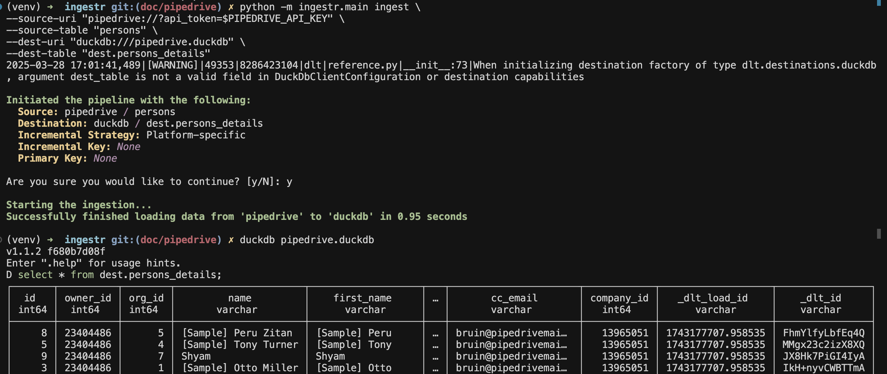

# Pipedrive
[Pipedrive](https://www.pipedrive.com/) is a cloud-based sales Customer Relationship Management (CRM) tool designed to help businesses manage leads and deals, track communication, and automate sales processes.

ingestr supports pipedrive as a source.

## URI format

The URI format for pipedrive is as follows:

```plaintext
pipedrive://?api_token=<api_token>
```

URI parameters:
- api_token: token used for authentication with the Pipedrive API

## Setting up a pipedrive Integration

To grab pipedrive credentials, please follow the guide [here](https://dlthub.com/docs/dlt-ecosystem/verified-sources/pipedrive#grab-api-token).

Once you complete the guide, you should have a `api_token`. Let's say your `api_token` is token_123, here's a sample command that will copy the data from pipedriveinto a DuckDB database:

```bash
ingestr ingest \
--source-uri 'pipedrive://?api_token=token' \
--source-table 'users' \
--dest-uri duckdb:///pipedrive.duckdb \
--dest-table 'dest.users'
```



pipedrive source allows ingesting the following resources into separate tables:

- `activities`: Refers to scheduled events or tasks associated with deals, contacts, or organizations
- `organizations`: Refers to company or entity with which you have potential or existing business dealings.
- `products`: Refers to items or services offered for sale that can be associated with deals
- `deals`: Refers to potential sale or transaction that you can track through various stages
- `users`: Refers to Individual with a unique login credential who can access and use the platform
- `persons`: Refers individual contacts or leads that can be linked to sales deals


Use these as `--source-table` parameter in the `ingestr ingest` command.
