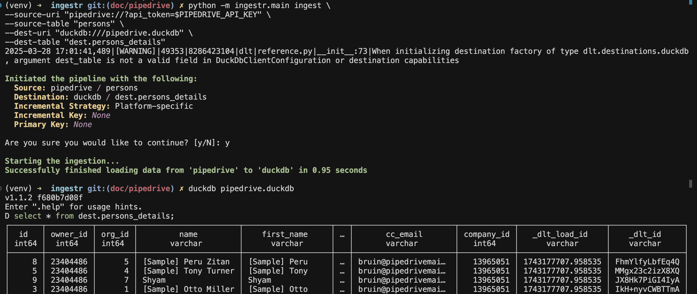

# Pipedrive
[Pipedrive](https://www.pipedrive.com/) is a cloud-based sales Customer Relationship Management (CRM) tool designed to help businesses manage leads and deals, track communication, and automate sales processes.

ingestr supports pipedrive as a source.

## URI format

The URI format for pipedrive is as follows:

```plaintext
pipedrive://?api_token=<api_token>
```

URI parameters:
- api_token: token used for authentication with the Pipedrive API

## Setting up a pipedrive Integration

To get your Pipedrive API token:

1. Log in to your Pipedrive account
2. Click on your profile picture in the top right corner
3. Select **Personal preferences**
4. Go to the **API** tab
5. Copy your **Personal API token**

Alternatively, you can create a new API token by clicking **Generate new token** if you want a dedicated token for this integration.

Once you have the `api_token`, let's say your `api_token` is token_123, here's a sample command that will copy the data from Pipedrive into a DuckDB database:

```bash
ingestr ingest \
--source-uri 'pipedrive://?api_token=token' \
--source-table 'users' \
--dest-uri duckdb:///pipedrive.duckdb \
--dest-table 'dest.users'
```



pipedrive source allows ingesting the following resources into separate tables:

| Table           | PK | Inc Key | Inc Strategy | Details                                                                                                                                        |
| --------------- | ----------- | --------------- | ------------------- | ---------------------------------------------------------------------------------------------------------------------------------------------- |  
| `activities` | id | update_time | merge | Refers to scheduled events or tasks associated with deals, contacts, or organizations |
| `deals` | id | update_time | merge | Refers to potential sale or transaction that you can track through various stages |
| `persons` | id | update_time | merge | Refers individual contacts or leads that can be linked to sales deals |
| `organizations` | id | update_time | merge | Refers to company or entity with which you have potential or existing business dealings. |
| `products` | id | update_time | merge | Refers to items or services offered for sale that can be associated with deals |
| `users` | id | update_time | merge | Refers to Individual with a unique login credential who can access and use the platform |


Use these as `--source-table` parameter in the `ingestr ingest` command.
