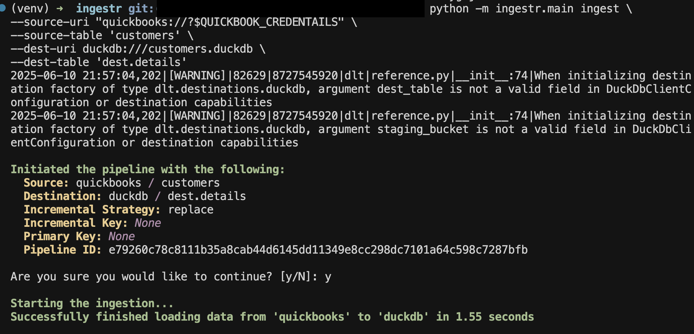

# QuickBooks

[QuickBooks](https://quickbooks.intuit.com/) is an accounting software package developed and marketed by Intuit.

ingestr supports QuickBooks as a source.

## URI format

```plaintext
quickbooks://?company_id=<company_id>client_id=<client_id>&client_secret=<client_secret>&refresh_token=<refresh_token>&access_token=<access_token>&environment=<environment>&minor_version=<minor_version>
```

URI parameters:
- `company_id`: The QuickBooks company (realm) id.
- `client_id`: OAuth client id from your Intuit application.
- `client_secret`: OAuth client secret.
- `refresh_token`: OAuth refresh token used to obtain access tokens.
- `environment`: Optional environment name, either `production` or `sandbox`. Defaults to `production`.
- `minor_version`: Optional API minor version.

## Setting up a QuickBooks integration

Follow Intuit's [OAuth setup guide](https://developer.intuit.com/app/developer/qbo/docs/develop/authentication-and-authorization) to create an app and generate your credentials.

Once you have the credentials, you can ingest data. For example, to copy customers data into DuckDB:

```sh
ingestr ingest \
--source-uri 'quickbooks://?company_id=1234567890&client_id=cid&client_secret=csecret&refresh_token=rtoken' \
--source-table 'customers' \
--dest-uri duckdb:///customers.duckdb \
--dest-table 'dest.details'
```
This command will retrieve customers data and save it to the `dest.details` table in the DuckDB database.




## Tables
QuickBooks source allows ingesting the following tables:

- `customers`: Retrives list of customers.
- `invoices`: Retrives sales invoices.
- `accounts`: Retrives details of accounts.
- `vendors`: Retrives vendor records.
- `payments`: Retrives payments recorded.

Use these as the `--source-table` parameter in the `ingestr ingest` command.

