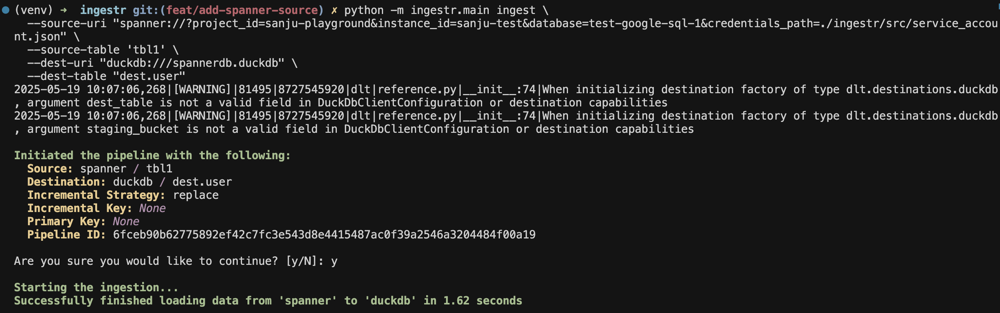

# GCP Spanner
[GCP Spanner](https://cloud.google.com/spanner) is a fully managed, scalable, and strongly consistent database service.

ingestr supports GCP Spanner as a source.

## URI format
The URI format for Spanner is as follows:


```plaintext
spanner://?project_id=<project_id>&instance_id=<instance_id>&database=<database>&credentials_path=</path/to/service/account.json>
```
or
```plaintext
spanner://?project_id=<project_id>&instance_id=<instance_id>&database=<database>&credentials_base64=<base64_encoded_credentials>
```

URI parameters:
- `project_id`: Your Google Cloud project ID (e.g., "my-project-123")
- `instance_id`: The Spanner instance ID (e.g., "my-instance")
- `database`: The database name (e.g., "my-database")
- `credentials_path`: Path to your Google Cloud service account JSON file
- `credentials_base64`: Base64-encoded service account credentials (alternative to credentials_path)

Let's say we have the above credentials. Here's a sample command that will copy the data from Spanner (GoogleSQL) to DuckDB.

```sh
ingestr ingest \
  --source-uri 'spanner://?project_id=id_123&instance_id=instance_123&database=db_123&credentials_path=./service_account.json' \
  --source-table 'users' \
  --dest-uri duckdb:///spanner.duckdb \
  --dest-table 'dest.output'

```



> [!NOTE]
> Currently, only GoogleSQL databases are supported.


