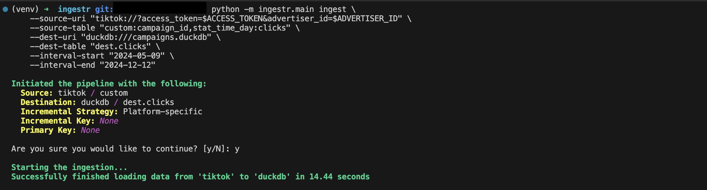

# TikTok Ads
TikTok Ads is an advertising platform that enables businesses and marketers to create, manage, and analyze ad campaigns targeting TikTok's user base.

Ingestr supports TikTok Ads as a Source.

## URI format
The URI format for TikTok Ads as a Source is as follows:

```plaintext
tiktok://?access_token=<ACCESS_TOKEN>&advertiser_ids=<advertiser_ids>&timezone=<timezone>
```
## URI parameters:
- `access_token` (required): Used for authentication and is necessary to access reports through the TikTok Marketing API.
- `advertiser_ids` (required): The comma-separated list of advertiser IDs to retrieve data for.
- `timezone` (optional): The timezone to use for the data retrieval, you should set this value to the timezone of the advertiser account. Defaults to `UTC`.

TikTok requires an `access_token` and `advertiser_ids` to retrieve reports from the TikTok marketing API. Please follow the guide to obtain the [credentials](https://business-api.tiktok.com/portal/docs?id=1738373141733378).

## Table: Custom Reports
Custom reports allow you to retrieve data based on specific `dimensions`, `metrics`, and `filters`.

Custom Table Format:
```
custom:<dimensions>:<metrics>[:<filter_name,filter_values>]
```
### Parameters:
- `dimensions`(required): A comma-separated list of [dimensions](https://business-api.tiktok.com/portal/docs?id=1751443956638721) to retrieve.
- `metrics`(required): A comma-separated list of [metrics](https://business-api.tiktok.com/portal/docs?id=1751443967255553) to retrieve.
- `filters` (optional): Filters are specified in the format `<filter_name=filter_values>`. 
    - `filter_name`: The name of the filter (e.g. `campaign_ids`).
    - `filter_values`: A comma-separated list of one or more values associated with the filter name (e.g., `camp_id123,camp_id456`). Only the `IN` filter type is supported. Learn more about [filters](https://business-api.tiktok.com/portal/docs?id=1751443975608321.). 

> [!NOTE]
> Ingestr will fetch data for the last 30 days and use the default page size of `1000`. You can override this by specifying the `interval_start` and `interval_end` parameters.

### Example

Retrieve data for campaigns with `campaign_ids` camp_id123 and camp_id456:
```sh
ingestr ingest \
    --source-uri "tiktok://?access_token=token_123&advertiser_ids=0594720014,0594720015" \
    --source-table "custom:campaign_id,stat_time_day:clicks,cpc" \
    --dest-uri "duckdb:///campaigns.duckdb" \
    --dest-table "dest.clicks"
```

The applied parameters for the report are:
- dimensions: `campaign_id` and `country_code`
- metrics: `clicks` and `cpc`
- filters: `campaign_ids` for `camp_id123` and `camp_id456`


This command will retrieve data for the specified date range and save it to the `dest.clicks` table in the DuckDB database.




