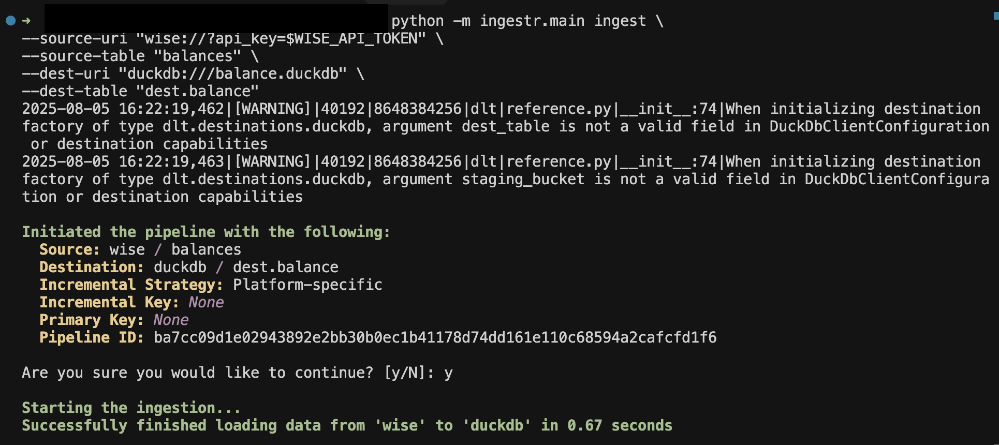

# Wise

[Wise](https://wise.com/) is a global financial technology company that provides international money transfers, multi-currency accounts, and business payment solutions.

ingestr supports Wise as a source.

## URI format

```plaintext
wise://?api_key=<api_token>
```

URI parameters:

- `api_key`: Wise API token.

### Please follow the steps below to get a Wise API token
- Go to wise.com and log in.
- Click on your profile picture.
- From the dropdown, choose "Settings".
- In the left-hand menu, click "API Tokens".
- Click "Create API Token".
- Give it a name.
- Click "Create".
Copy the token and save it securely..

## Example

Copy transfers from Wise into a DuckDB database:

```sh
ingestr ingest \
    --source-uri 'wise://?api_key=mytoken' \
    --source-table transfers \
    --dest-uri duckdb:///wise.duckdb \
    --dest-table wise.transfers
```

## Tables

Wise source allows ingesting the following sources into separate tables:
| Table           | PK | Inc Key | Inc Strategy | Details                                                                                                                                        |
| --------------- | ----------- | --------------- | ------------------- | ---------------------------------------------------------------------------------------------------------------------------------------------- |
| `profiles`        | `id` | –                | merge               | Retrieves all profiles  associated with the user. |
| `transfers` | `id` |    `created`             | merge               | Lists all transfers for including status and details associated with the user.                                           |
| `balances`   | `id` | `modificationTime`     | merge  | Retrieve the user's multi-currency account balance accounts. It returns all balance accounts the profile has.



