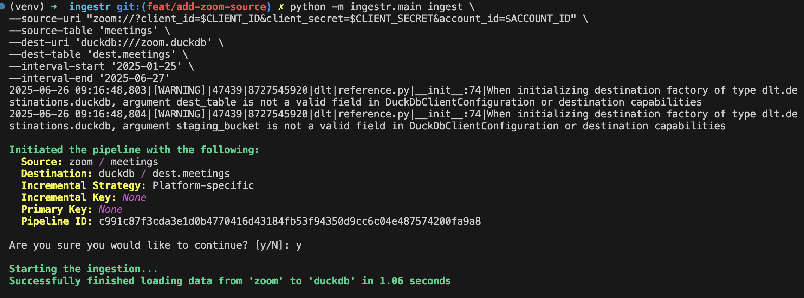

# Zoom

[Zoom](https://www.zoom.com/) is a video conferencing and collaboration platform.

ingestr supports Zoom as a source.

## Prerequisites
- A [Zoom Server-to-Server OAuth App](https://developers.zoom.us/docs/internal-apps/s2s-oauth/)
- Appropriate permissions related to meetings, users and participants must be added in the app's scopes
`user:read,user:write,user:read:admin,user:write:admin`
- Obtain the `client_id`, `client_secret` and `account_id`  credentials from the app

## URI format
```plaintext
zoom://?client_id=<client_id>&client_secret=<client_secret>&account_id=<account_id>
```

This command copies meetings data from the Zoom source to DuckDB.

```sh
ingestr ingest \
  --source-uri 'zoom://?client_id=abc&client_secret=xyz&account_id=123' \
  --source-table 'meetings' \
  --dest-uri duckdb:///zoom.duckdb \
  --dest-table 'dest.meetings'
```


## Tables

Zoom source allows ingesting the following tables:

| Table           | PK | Inc Key | Inc Strategy | Details                                                                                                                                        |
| --------------- | ----------- | --------------- | ------------------- | ---------------------------------------------------------------------------------------------------------------------------------------------- |
| [meetings](https://developers.zoom.us/docs/api/rest/reference/zoom-api/methods/#operation/meetings)     | id | start_time | merge               | Retrieve all valid previous meetings, live meetings, and upcoming scheduled meetings for all users in the given Zoom account. Permissions required: meeting:read:admin,meeting:read, Granular permissions, meeting:read:list_meetings,meeting:read:list_meetings:admin |
| users       | id | – | merge               | Retrieve a list of users in your account. Permissions required: user:read, user:write, user:read:admin, user:write:admin, Granular permissions: user:read:list_users:admin, Prerequisites: A Pro or higher plan. |
| [participants](https://developers.zoom.us/docs/api/rest/reference/zoom-api/methods/#operation/reportMeetingParticipants)  | id | join_time | merge               | Return a report of a past meeting that had participants, including the host. It only returns data for meetings within the last 6 months.Permissions required: report:read:admin. Granular permissions: report:read:list_meeting_participants:admin. Prerequisites: A Pro or higher plan. |

Use these as the `--source-table` parameter in the `ingestr ingest` command.
