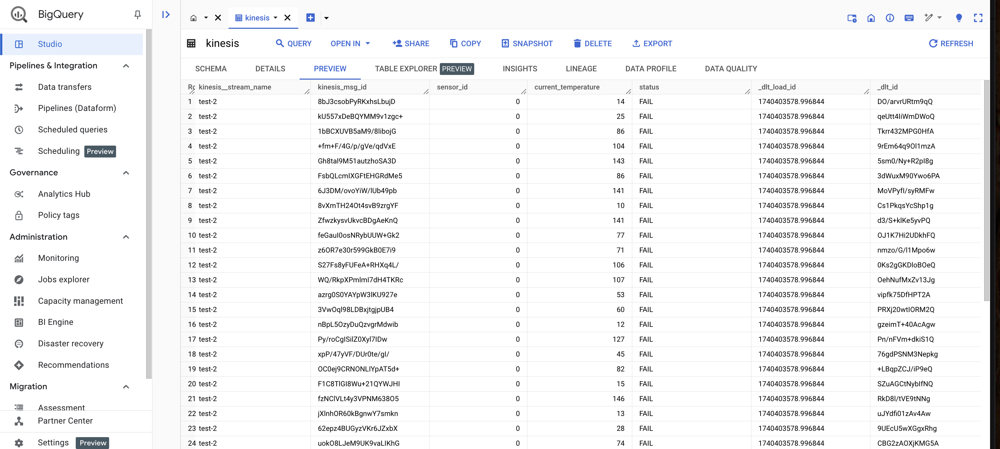

# Load Data from Amazon Kinesis to Google BigQuery

Welcome! 👋  
 This beginner-friendly guide will help you load data from `Amazon Kinesis` into `Google BigQuery` using `ingestr` — a simple yet powerful command-line tool. No prior experience is needed, and best of all, no coding required!

By the end of this guide, you'll have your Kinesis data securely stored in BigQuery. But before we dive in, let’s take a quick look at `ingestr`.

## Overview of ingestr

`ingestr` is a command-line tool that simplifies data ingestion by allowing users to load data from a source to a destination using simple command-line flags.

### ingestr Command

```bash
ingestr ingest \   
   --source-uri '<your-source-uri-here>' \   
   --source-table '<your-schema>.<your-table>' \   
   --dest-uri '<your-destination-uri-here>' \   
   --dest-table '<your-schema>.<your-table>'
```

- `ingestr ingest`: Executes the data ingestion process.
- `--source-uri TEXT`: Specifies the URI of the data source.
- `--dest-uri TEXT`: Specifies the URI of the destination.
- `--source-table TEXT`: Defines the table to fetch data from.
- `--dest-table TEXT`: Specifies the destination table. If not provided, it defaults to `--source-table`.

With this command, we connect to the source, retrieve the specified data, and load it into the destination database.

## Let's Load Data from Kinesis to BigQuery Together!

Amazon Kinesis is a cloud-based service for real-time data streaming and analytics that processes large data streams. To analyze this data, you may need to load it into a data warehouse like Google BigQuery. `ingestr` makes this process simple.

### Step 1: Install ingestr

Ensure `ingestr` is installed. If not, follow the installation guide [here](../getting-started/quickstart.md#Installation).

### Step 2: Get AWS Credentials
Kinesis will be our data source. To access it, you need AWS credentials.

1. Log in to your AWS account.
2. Navigate to `IAM` (Identity and Access Management).
3. Create a new IAM user or select an existing one.
4. Assign necessary permissions (e.g., `AmazonKinesisReadOnlyAccess`).
5. Generate and copy the `Access Key ID` and `Secret Access Key`.

For more details, read [here](https://docs.aws.amazon.com/IAM/latest/UserGuide/introduction.html).

### Step 3: Configure Kinesis as Source

#### `--source-uri`
This flag connects to your Kinesis stream. The URI format is:

```bash
kinesis://?aws_access_key_id=<YOUR_KEY_ID>&aws_secret_access_key=<YOUR_SECRET_KEY>&region_name=<YOUR_REGION>
```

Required parameters:
- `aws_access_key_id`: Your AWS access key
- `aws_secret_access_key`: Your AWS secret key
- `region_name`: AWS region of your Kinesis stream

#### `--source-table`
This flag specifies which Kinesis stream to read from:

```bash
--source-table 'kinesis_stream_name'
```
This flag specifies which Kinesis stream to read from:
### Step 4: Configure BigQuery as Destination

#### `--dest-uri`
This flag connects to BigQuery. The URI format is:

```bash
bigquery://<project-name>?credentials_path=/path/to/service/account.json&location=<location>
```

Required parameters:
- `project-name`: Your BigQuery project name
- `credentials_path`: Path to the service account JSON file
- `location`: (Optional) Dataset location

#### `--dest-table`
This flag specifies where to save the data:

```bash
--dest-table 'dataset.table_name'
```

### Step 5: Run the ingestr Command

Execute the following command to load data from Kinesis to BigQuery:

```bash
ingestr ingest \   
    --source-uri 'kinesis://?aws_access_key_id=<YOUR_KEY_ID>&aws_secret_access_key=<YOUR_SECRET_KEY>&region_name=eu-central-1' \   
    --source-table 'kinesis_stream_name' \   
    --dest-uri 'bigquery://project-name?credentials_path=/Users/abc.json' \   
    --dest-table 'dataset.results'
```

### Step 6: Verify Data in BigQuery
Once the command runs successfully, your Kinesis data will be available in BigQuery. Follow these steps to verify the data:

1. Open the [BigQuery Console](https://console.cloud.google.com/bigquery) and select your project.

2. In the left-hand side panel:
    - Expand your project.
    - Navigate to the appropriate dataset and click on the table name.

3. Select the "Preview" tab to view a sample of the ingested data.
    - Confirm that rows are present and fields appear as expected.

5. Go to the "Query" tab and run a basic query to inspect your data more closely. For example:
```sql
SELECT * FROM `project-name.dataset.results` LIMIT 100;

```

Ensure that the retrieved data matches what was expected from the Kinesis stream.

### Example Output

After running the ingestion process, your Kinesis data will be available in BigQuery. Here's an example of what the data might look like:



## 🎉 Congratulations!
You have successfully loaded data from Amazon Kinesis to BigQuery using `ingestr`.