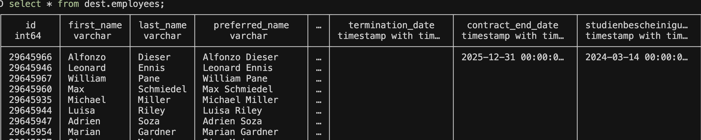

# Load Data from Personio to DuckDB

Welcome! 👋  
 This beginner-friendly guide will help you load data from `Personio` into `DuckDB` using ingestr — a simple yet powerful command-line tool. No prior experience is needed, and best of all, no coding required!

By the end of this guide, you'll have your Personio data securely stored in DuckDB. But before we dive in, let’s take a quick look at `ingestr`

## Overview of ingestr
`ingestr` is a command-line tool that simplifies data ingestion by allowing users to load data from a source to a destination using simple command-line flags.

### `ingestr` Command
```bash
ingestr ingest \
   --source-uri '<your-source-uri-here>' \
   --source-table '<your-schema>.<your-table>' \
   --dest-uri '<your-destination-uri-here>' \
   --dest-table '<your-schema>.<your-table>'
```
- `ingestr ingest`: Executes the data ingestion process.
- `--source-uri TEXT`: Specifies the URI of the data source.
- `--dest-uri TEXT`: Specifies the URI of the destination.
- `--source-table TEXT`: Defines the table to fetch data from.
- `--dest-table TEXT`: Specifies the destination table. If not provided, it defaults to `--source-table`.

With this command, we connect to the source, retrieve the specified data, and load it into the destination database.
## Let's Load Data from Personio to DuckDB Together!

Personio is a human resources management platform that helps businesses handle recruitment and employee data. To analyze this data, you may need to load it into an analytics database like DuckDB. `ingestr` makes this process simple.

### Step 1: Install `ingestr`
Ensure `ingestr` is installed. If not, follow the installation guide [here](../getting-started/quickstart.md#Installation).

### Step 2: Get Personio Credentials
Personio will be our data source.
1. Log in to your Personio account.
2. Ensure your user has API access.
3. Navigate to **Settings > Integrations > API Credentials**.
4. Click **Generate new credentials**.
5. Assign **read access** to required attributes (e.g., last name, last modified).
6. Copy the generated `client ID` and `client secret`.

For more details, refer to [Personio API documentation](https://developer.personio.de/docs/getting-started-with-the-personio-api#21-employee-attendance-and-absence-endpoints).

### Step 3: Install DuckDB
DuckDB will be our data destination. If it’s not already installed, you can install it using pip:
```bash
pip install duckdb
```  
Alternatively, you can download the latest version from the [official DuckDB website](https://duckdb.org/docs/installation/?version=stable&environment=cli&platform=macos&download_method=direct).

### Step 4: Run the `ingestr` Command
Execute the following command to load data from Personio to DuckDB:
```bash
ingestr ingest \
    --source-uri 'personio://?client_id=<YOUR_CLIENT_ID>&client_secret=<YOUR_CLIENT_SECRET>' \
    --source-table 'employees' \
    --dest-uri 'duckdb:///personio.duckdb' \
    --dest-table 'dest.employees'
```
- `--source-uri 'personio://?client_id=<ID>&client_secret=<SECRET>'`: Connects to Personio using API credentials.
- `--source-table 'employees'`: Specifies the table to fetch data from Personio.
- `--dest-uri 'duckdb:///personio.duckdb'`: Specifies DuckDB as the destination database.
- `--dest-table 'dest.employees'`: Defines where the data will be stored in DuckDB.


## Verify Data in DuckDB
Once the command runs successfully, your Personio data will be available in DuckDB. Follow these steps to verify the data:

### Step 1: Open DuckDB
If DuckDB is installed, you can open it using the following command:
```bash
duckdb personio.duckdb
```

### Step 2: List Available Tables
To check if the `employees` table has been created, run:
```sql
.tables;
```

### Step 3: View Data in the `employees` Table
To display all data from the `employees` table, run:
```sql
SELECT * FROM dest.employees;
```

### Step 4: Validate Data
Ensure that the retrieved data matches what was expected from Personio.

Example output:



🎉 **Congratulations!** You have successfully loaded data from Personio to DuckDB using `ingestr`. 

