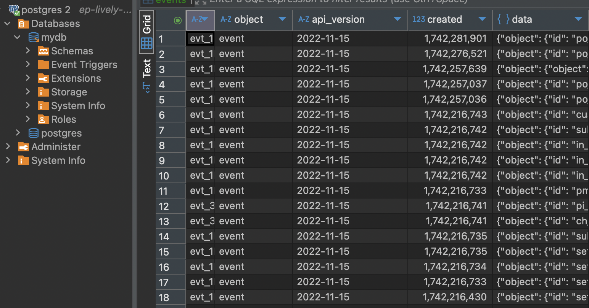

# Load Data from Stripe to PostgreSQL

Welcome! 👋 This beginner-friendly guide will help you load data from `Stripe` into `PostgreSQL` using ingestr — a simple yet powerful command-line tool. No prior experience is needed, and best of all, no coding required! 🚀

By the end of this guide, you'll have your Stripe data securely stored in PostgreSQL. But before we dive in, let’s take a quick look at ingestr.

## Overview of `ingestr`
`ingestr` is a command-line tool that simplifies data ingestion by allowing users to load data from a source to a destination.

### `ingestr` Command
```bash
ingestr ingest \
   --source-uri '<your-source-uri-here>' \
   --source-table '<your-schema>.<your-table>' \
   --dest-uri '<your-destination-uri-here>' \
   --dest-table '<your-schema>.<your-table>'
```
- `ingestr ingest`: Executes the data ingestion process.
- `--source-uri TEXT`: Defines the source database URI.
- `--dest-uri TEXT`: Defines the destination database URI.
- `--source-table TEXT`: Specifies the table to fetch data from.
- `--dest-table TEXT`: Defines where the data should be stored (defaults to `--source-table` if not specified).

With this command, we connect to the source, retrieve the specified data, and load it into the destination database.

## Let's Load Data from Stripe into PostgreSQL Together!

Stripe is a popular payment processing platform used by e-commerce and SaaS applications. If you need to analyze Stripe data, you can load it into PostgreSQL, a reliable and widely used relational database.

## Step 1: Install `ingestr`
Ensure `ingestr` is installed on your system. If not, follow the installation guide [here](../getting-started/quickstart.md#Installation).

```bash
pip install ingestr
```

## Step 2: Retrieve Stripe API Credentials
Stripe will be our **data source**. To retrieve your API credentials:

1. Log in to your **Stripe Dashboard**: [dashboard.stripe.com](https://dashboard.stripe.com)
2. Navigate to **Developers** → **API Keys**.
3. Under **Standard Keys**, find:
   - **Secret Key**: Required for server-to-server requests
4. Click **Reveal Key** next to your **Secret Key** and copy it.

For detailed API documentation, visit the [Stripe API Docs](https://stripe.com/docs/api).

## Step 3: Retrieve PostgreSQL Credentials
In this example, we are using a **cloud-hosted PostgreSQL instance**.
1. Log in to your cloud provider (e.g., [Neon](https://neon.tech/)).
2. Navigate to your **PostgreSQL instance** and retrieve:
   - **Host**: Example - `your-db-instance.aws.com`
   - **Port**: Default is `5432`
   - **Database Name**: The database where Stripe data will be stored.
   - **Username & Password**: Credentials used to connect to PostgreSQL.
   - **sslmode**: Required depending on the security settings of your PostgreSQL instance

## Step 4: Run the `ingestr` Command
Execute the following command to load data from **Stripe to PostgreSQL**:

```bash
ingestr ingest \
    --source-uri 'stripe://?api_key=<YOUR_STRIPE_SECRET_KEY>' \
    --source-table 'event' \
    --dest-uri 'postgresql://<username>:<password>@<host>:<port>/<database-name>?sslmode=<sslmode>' \
    --dest-table 'dest.events'
```
- `--source-uri 'stripe://?api_key=<YOUR_STRIPE_SECRET_KEY>'`: Connects to Stripe using secret key .
- `--source-table 'event'`: Specifies the data to fetch data from Stripe.
- `--dest-uri 'postgresql://<username>:<password>@<host>:<port>/<database-name>?sslmode=<sslmode>'`: Connects to PostgreSQL as the destination database using the provided credentials.
- `--dest-table 'dest.events'`: Defines where the data will be stored in Postgres.

## Step 5: Verify Data in PostgreSQL via DBeaver

Once the command runs successfully, let's verify that the Stripe data has been loaded into PostgreSQL.

### 1: Connect to PostgreSQL via DBeaver
1. **Open DBeaver** and go to **Database** → **New Connection**.
2. Select **PostgreSQL**.
3. Enter your **PostgreSQL credentials**:
   - **Host**: `<your-host>`
   - **Port**: `5432` (default)
   - **Database**: `<your-database>`
   - **Username**: `<your-username>`
   - **Password**: `<your-password>`
4. Click **Test Connection** to verify.
5. If successful, click **Finish**.

### 2: Browse Tables
1. Expand your **PostgreSQL connection** in the **Database Navigator**.
2. Expand **Schemas** → **Public**.
3. Expand **Tables** and find `events`.

### 3: View Data in DBeaver
1. Right-click the `events` table.
2. Click **View Data** → **All Rows**.
3. Ensure that the retrieved data matches what was expected from Stripe.


🎉 Congratulations!
Your Stripe data is now securely stored in PostgreSQL 🚀